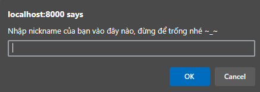

# anonymous-box-chat
### Giao tiếp trực tiếp 
Có hạn chế thời gian refresh lại trang (180s)
### Demo
Trang web [Demo](http://dinhthaison.glitch.me/)
- - -
## Hướng dẫn sử dụng
Website hạy bằng NodeJS, vì trang web chưa có cơ chế kiểm tra IP nên với mỗi tab có thể là 1 acc khác nhau

Mỗi lần Refresh lại trang sẽ phải nhập nickname 1 lần (Đảm bảo tính nặc danh)



Giao diện (Bấm vào để xem cho rõ)


Cơ chế Refresh lại trang sau 180s:
```
<script type="text/javascript">
      function reFresh() {
        window.open(location.reload(true));
      }
      window.setInterval("reFresh()",180000);
</script>
```
Khi có từ 2 thiết bị (Hoặc đơn giản là có thể trên cùng 1 máy, cùng 1 trình duyệt, đặt tên nickname và nhắn thì phía còn lại và tất cả những người dùng tham gia đồng thời đều nhận được tin nhắn như này)


Trong khi đó, tại Network --> WS, chúng ta bắt được sự kiện (Lý do từ code trong index.js)


Và đó là cách hoạt động (backend) của trang web này

## Deployment
```
npm instal
node .\index.js
```
Trang web được khởi chạy trên `localhost:8000`
# Tác giả
Son Dinh Thai: sondinh99999@gmail.com
